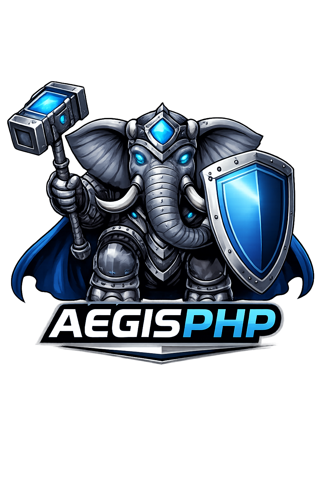

<center>

</center>

# 🛡️ AegisPHP

**AegisPHP** is a modular, minimalist, security-first PHP framework
designed to act like an RPG tank.

It stands on the front line, absorbing impact and protecting your domain
before any request reaches it.

No magic.\
No imposed structure.\
No unnecessary coupling.

You use only the modules you choose.

------------------------------------------------------------------------

## 🎯 Goals

-   PHP 8.5+
-   Fully modular via Composer (each package is independent)
-   Security-first by default
-   Clean Architecture friendly
-   No global state
-   No facades
-   No code generation
-   Compatible with:
    -   php-fpm
    -   RoadRunner
    -   Franklin
-   Minimal and stable core

------------------------------------------------------------------------

## 🧠 Philosophy: The RPG Tank

AegisPHP acts as a shield between the external world and your domain.

Everything passes through a defensive line:

Request → 🛡️ Phalanx Middleware → Gate → Domain

Core principles:

1.  Fail closed --- default behavior is to block\
2.  Immutability is armor\
3.  No magic = full control\
4.  Domain protected from infrastructure\
5.  Security is a mechanic, not a feature

------------------------------------------------------------------------

## 📦 Monorepo Structure

This repository is a monorepo containing all official packages:

```text
packages/

  ── Foundation
  core/
  arsenal/
  gate/

  ── Security
  bulwark/
  sigil/
  keep/

  ── Infrastructure
  ledger/
  vault/
  relay/
  sentinel/
  watchtower/

  ── Quality
  proving-grounds/
```

Each package can be installed independently.

------------------------------------------------------------------------

## 🧱 Core

`aegisphp/core` is intentionally small.

It provides only:

-   HTTP abstractions (Request, Response)
-   Middleware pipeline (PhalanxPipeline)
-   Config + Env
-   Simple event bus
-   Runtime strategy (php-fpm, RoadRunner, Franklin)

It does not include:

Router\
Container\
Authentication\
Database

Those belong to dedicated modules.

------------------------------------------------------------------------

## 🛠️ Minimal Example

``` php
use Aegis\Core\Http\BasicResponse;
use Aegis\Core\Http\Request;
use Aegis\Core\Http\Response;
use Aegis\Core\Middleware\Handler;
use Aegis\Core\Middleware\Middleware;
use Aegis\Core\Middleware\PhalanxPipeline;
use Aegis\Core\Runtime\PhpFpmRuntime;

$app = (new PhalanxPipeline())->pipe([
    new class implements Middleware {
        public function process(Request $request, Handler $next): Response
        {
            return (new BasicResponse(200))->write('Hello, Aegis');
        }
    },
]);

$runtime = new PhpFpmRuntime();
$runtime->run($app);
```

------------------------------------------------------------------------

## 🔐 Security by Default

The core enforces minimal, predictable secure defaults:

-   Fail-closed pipeline with 404 Not Found terminal handler
-   Explicit Content-Type (text/plain; charset=utf-8) when missing
-   Immutable HTTP abstractions (Request, Response)

Advanced controls live in specialized modules (bulwark, sigil, keep,
sentinel).

------------------------------------------------------------------------

## 🧬 Clean Architecture Friendly

The framework does not invade your domain.

-   No domain class depends on AegisPHP\
-   Middleware lives at the interface layer\
-   Infrastructure is replaceable

------------------------------------------------------------------------

## 🧪 Quality Standards

-   High-level PHPStan\
-   PHPUnit\
-   Immutable HTTP objects\
-   No global state

------------------------------------------------------------------------

## 🗺️ Roadmap

M0 --- Core\
M1 --- Arsenal + Gate\
M2 --- Bulwark + Sentinel\
M3 --- Sigil + Keep\
M4 --- Ledger + Vault + Relay + Watchtower

------------------------------------------------------------------------

## 🧾 License

MIT

------------------------------------------------------------------------

## 🛡️ Motto

Stay behind the shield.
